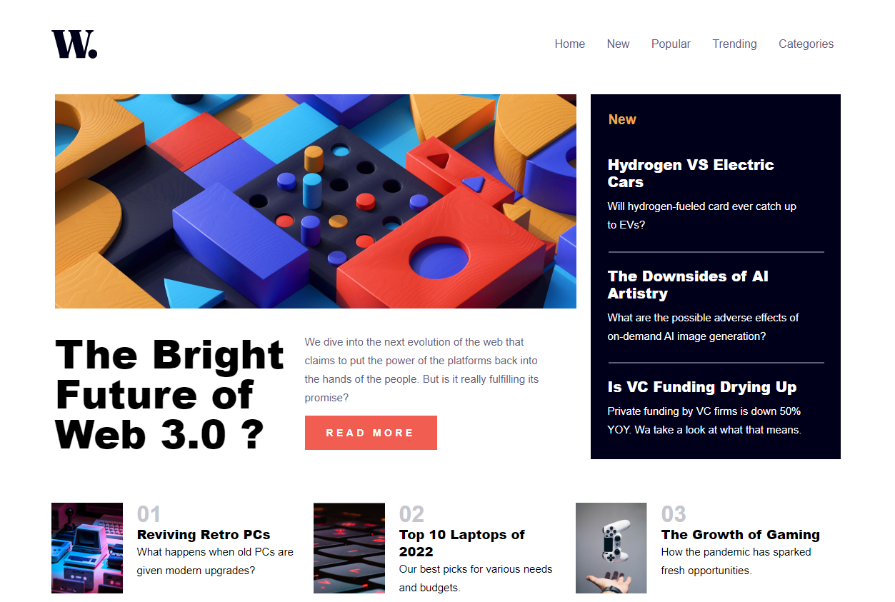
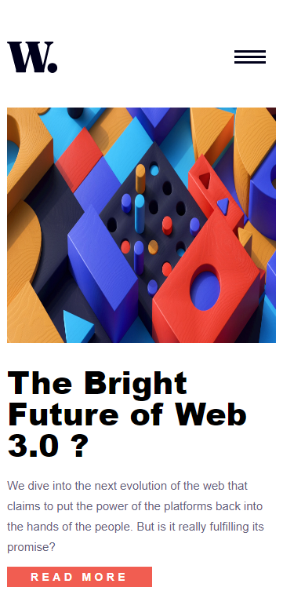
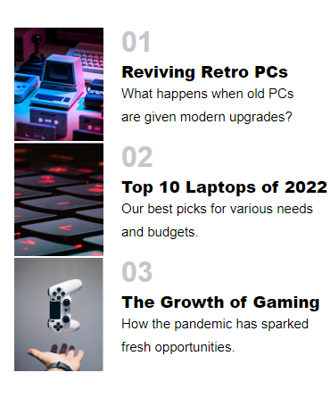

# **Web 3.0**

Here's my first blog exercise with HTML and CSS based on this Figma: 
https://www.figma.com/design/87gRFe00lSsdbnQx83jufY/FLEX-GRID-RESPONSIVE?node-id=0-1 

A great way to practice basics and media queries !

## Installation

To run this project, you will need NodeJS environment installed in your machine.
If you don't already have you can find latest version here: https://nodejs.org/en

## Start project

After cloning this repository, you will need to moove inside this folder using:

```bash
cd web3.0
```

Then simply run it with:

```bash
node index.html
```

## Screenshots

### Web View


### Mobile View




### Author
Stéphen Chevalier - Passionated Web developer that code with ♥
